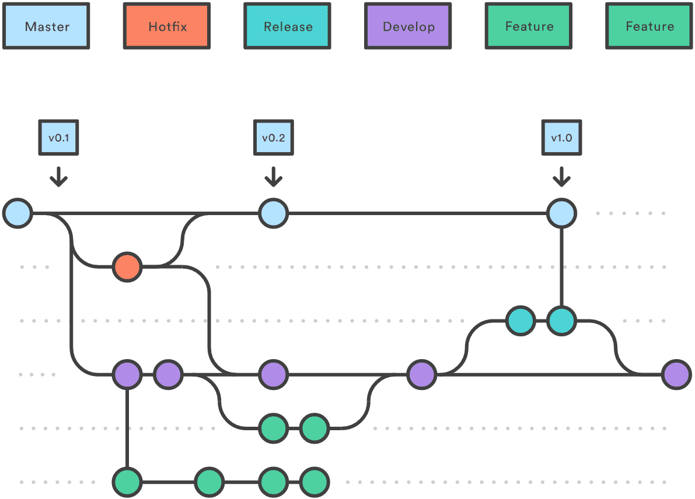

#################
MBO Compute Hub
#################

Section Navigation
===================

.. toctree::
    :maxdepth: 2

    Pipelines <pipelines/index>
    Guides <guides/index>

Branch/Versioning
======================

.. image:: _static/_images/general/gh_flow.svg
   :alt: git-flow

.. thumbnail:: _static/_images/general/gh_flow.png
   :alt: git-flow

.. thumbnail:: _static/_images/general/gh_flow.png
   :alt: git-flow

.. |Publication| image:: https://zenodo.org/badge/DOI/10.1007/978-3-319-76207-4_15.svg
      :target: https://doi.org/10.1038/s41592-021-01239-8

.. |issues| image:: https://img.shields.io/github/issues/Naereen/StrapDown.js.svg
      :target: https://GitHub.com/MillerBrainObservatory/LBM-CaImAn-MATLAB/issues/

.. |release| image:: https://img.shields.io/github/release/Naereen/StrapDown.js.svg
      :target: https://GitHub.com/MillerBrainObservatory/LBM-CaImAn-MATLAB/releases/

.. |Docs| image:: https://img.shields.io/badge/LBM%20Documentation-1f425f.svg
   :target: https://millerbrainobservatory.github.io/LBM-CaImAn-MATLAB/

.. |DOI| image:: https://zenodo.org/badge/DOI/10.1007/978-3-319-76207-4_15.svg
      :target: https://doi.org/10.1038/s41592-021-01239-8

Contributions
======================

We welcome contributions to our repositories. Please check the issues and pull request sections to see where you can help.

Indices and tables
=====================================

* :ref:`genindex`
* :ref:`modindex`
* :ref:`search`

.. _CNMF: https://github.com/simonsfoundation/NoRMCorre
.. _CaImAn: https://github.com/flatironinstitute/CaImAn-MATLAB/
.. _ScanImage: https://www.mbfbioscience.com/products/scanimage/
.. _publication: https://www.nature.com/articles/s41592-021-01239-8/
.. _MROI: https://docs.scanimage.org/Premium%2BFeatures/Multiple%2BRegion%2Bof%2BInterest%2B%28MROI%29.html#multiple-region-of-interest-mroi-imaging/
.. _DataSheet: https://docs.google.com/spreadsheets/d/13Vfz0NTKGSZjDezEIJYxymiIZtKIE239BtaqeqnaK-0/edit#gid=1933707095/
.. _MBO: https://mbo.rockefeller.edu/
.. _Slides: https://docs.google.com/presentation/d/1A2aytY5kBhnfDHIzNcO6uzFuV0OJFq22b7uCKJG_m0g/edit#slide=id.g2bd33d5af40_1_0/
.. _NoRMCorre: https://github.com/flatironinstitute/NoRMCorre/
.. _constrained-foopsi: https://github.com/epnev/constrained-foopsi/
.. _startup.m: https://www.mathworks.com/help/matlab/matlab_env/matlab-startup-folder.html
.. _startup: https://www.mathworks.com/help/matlab/matlab_env/matlab-startup-folder.html
.. _BigTiffSpec: _https://docs.scanimage.org/Appendix/ScanImage%2BBigTiff%2BSpecification.html#scanimage-bigtiff-specification
