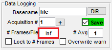

(mbo_hub)=
# Miller Brain Observatory: Compute Ecosystem

A hub for tutorials, guides and resources for computational image processing.

(reference_dataset)=
```{note} Reference Dataset
All examples used throughout this tutorial will be in reference to the demo dataset referred to as the 'high-resolution' dataset.
This dataset contains 4 ROI's recorded at `9.6 Hz` for `1730` over a `600x600 um` FOV at `1um/px` resolution.
```

-----

## Pipelines

::::{grid} 2
:gutter: 2

:::{grid-item-card} MBO Utilities
{bdg-link-primary-line}`To the Documentation <https://millerbrainobservatory.github.io/mbo_utilities/index.html>`
+++
[](https://github.com/MillerBrainObservatory/mbo_utilities.git "MBO Utilities Repository")
:::
:::{grid-item-card} LBM-Suite2p-Python
{bdg-link-primary-line}`To the Documentation <https://millerbrainobservatory.github.io/lbm_suite2p_python/index.html>`
+++
[](https://github.com/MillerBrainObservatory/LBM-Suite2p-Python.git "LBM-Suite2p-Python Repository")
:::
::::

::::{grid} 2
:gutter: 2

:::{grid-item-card} LBM-CaImAn-MATLAB 
{bdg-link-primary-line}`To the Documentation <https://millerbrainobservatory.github.io/LBM-CaImAn-MATLAB/index.html>`
+++
[](https://github.com/MillerBrainObservatory/LBM-CaImAn-MATLAB "LBM-CaImAn-MATLAB Repository")
:::
:::{grid-item-card} LBM-CaImAn-Python
{bdg-link-primary-line}`To the Documentation <https://millerbrainobservatory.github.io/LBM-CaImAn-Python/index.html>`
+++
[](https://github.com/MillerBrainObservatory/LBM-CaImAn-Python.git "LBM-CaImAn-Python Repository")
:::
::::

--------

## Documentation Contents

```{toctree}
---
maxdepth: 3
---

guides/lbm_data.md
guides/mbo_servers.md

```

--------

(mbo_terms)=
## Terms

Light-beads microscopy is a 2-photon imaging paradigm based on [ScanImage](https://docs.scanimage.org/index.html) acquisition software.

| Dimension | Description |
|-----------|-------------|
| [X, Y]    | 2D plane    |
| [X, Y, Z] | z-stack     |
| [X, Y, T] | 2D timeseries |
| [X, Y, Z, T] | 3D timeseries|

## Frame Ordering

ScanImage saves raw tiffs with each z-depth and timepoint interleaved [zT]:

- frame0 = time0_plane1
- frame1 = time0_plane2
- frame2 = time0_plane3
- frame3 = time1_plane1
- frame4 = time1_plane2

Thus a primary function of image assembly is to {ref}`ex_deinterleave`.

```{admonition} Note on Frames
:class: tip

Before beginning the recording session, users have the option to split frames in the recording across multiple `.tiff` files. This option is helpful as it requires less work in post-processing to ensure there isn't too much computer memory being used.



```
<!-- .. TODO:: Guide users to the correct spot.  Move scanreader to python.  -->

--------


## External Resources

### Algorithms and pipelines

- [flatironinstitute/CaImAn (MATLAB) github](https://github.com/flatironinstitute/CaImAn-MATLAB) | [Wiki](https://github.com/flatironinstitute/CaImAn-MATLAB/wiki/Complete-analysis-pipeline)

- [flatironinstitute/CaImAn (python) github](https://github.com/flatironinstitute/CaImAn)| [caimain Docs](https://caiman.readthedocs.io/en/latest/)

- [suite2p github](https://github.com/mouseland/suite2p) | [suite2p Docs](https://suite2p.readthedocs.io/en/latest/)

### Blog Posts

- [What is deconvolution? (Suite2p docs)](https://suite2p.readthedocs.io/en/latest/FAQ.html#deconvolution-means-what)

- [Why your two-photon images are noisier than you expect](https://gcamp6f.com/2024/04/24/why-your-two-photon-images-are-noisier-than-you-expect/)

- [Interpreting Results of Calcium Denoising](https://gcamp6f.com/2022/08/23/self-supervised-denoising-of-calcium-imaging-data/)

- [Image.sc Forum](https://forum.image.sc/)

